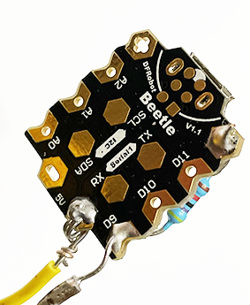

  

# End that call v0.1

End Teams and Zoom calls with an emergency button

### Based on

- https://github.com/alan707/zoom_button

### Bill of materials

- A push button. I used https://www.amazon.com/Baomain-Emergency-Switch-Button-Weatherproof/dp/B00NTT91Y0.

  

- A **32u4 or SAMD** microboard with Micro-USB. Smallest is best. I used DrRobot's Beetle https://www.amazon.es/gp/product/B01B0IQFU4/ref=ppx_yo_dt_b_search_asin_title?ie=UTF8&psc=1 which is really small and easy to fit into the push button.

  

- A 47K ohm resistor.

  

- Any Micro USB cable.

- A couple of solid-wire cables you might have running around. Stranded will do as well.

### Pinout / Wiring

- To avoid having the pin floating when the switch is open, you'll need to solder a resistor (in my tests 22K ohm was not enough, but 47K ohm worked perfect) from D9 to ground:

  

- Solder a cable to the 5V pin and another cable to the D9 pin (in my case I soldered it to the resistor's leg going through the D9 hole:

  

  

Yeah, I know, my soldering was far from perfect :-) It works though...

- Connect the cable from the 5V pin to the Normally Open terminal on the switch (usually labeled NO).

- Connect the cable from the D9 pin to the Common terminal on the switch. If you use another digital pin, remember to adjust the 'pin' variable accordingly.

  

**\*\*Warning\*\* Pictures were taken without proper insulation. Don't forget to cover the exposed wires with some insulation.**

- Connect your micro-USB cable.

- Cut a hole for the USB cable:

  

### Fitting the board inside the plug

This might be tricky depending on your setup and board. Because the Beetle is so small it was not really an issue. You'll need some Dremel work to open a hole for the usb cable.

### Setup needed

- In the code, check the 'pin' and 'target' variables. For the latter, only one OS/app should be selected.

### How does it work

- First it tries to get app on focus by searching for it. 
- Then it ends the call by either using the appropriate shortcut or by navigating to the right button (tab-tab-tab + intro).
- All magic is done sending keys from the Arduino using https://www.arduino.cc/reference/en/language/functions/usb/keyboard/

### Tested On
- Windows 10, Teams and Zoom
- OSX 10.14, Teams and Zoom
